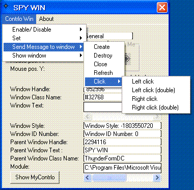

<div align="center">

## spy any programs


</div>

### Description

it is pro for spy and control any program

it is smart code and very good

I named it spy win

plase vote for me
 
### More Info
 


<span>             |<span>
---                |---
**Submitted On**   |2007-10-18 13:35:32
**By**             |[abdallah najar](https://github.com/Planet-Source-Code/PSCIndex/blob/master/ByAuthor/abdallah-najar.md)
**Level**          |Intermediate
**User Rating**    |5.0 (15 globes from 3 users)
**Compatibility**  |VB 5\.0, VB 6\.0
**Category**       |[Windows API Call/ Explanation](https://github.com/Planet-Source-Code/PSCIndex/blob/master/ByCategory/windows-api-call-explanation__1-39.md)
**World**          |[Visual Basic](https://github.com/Planet-Source-Code/PSCIndex/blob/master/ByWorld/visual-basic.md)
**Archive File**   |[spy\_any\_pr20876310172007\.zip](https://github.com/Planet-Source-Code/abdallah-najar-spy-any-programs__1-69518/archive/master.zip)

### API Declarations

```
Public Declare Function EnableWindow Lib "user32.dll" (ByVal hWnd As Long, ByVal fEnable As Long) As Long
Public Const EW_Enable = 1
Public Const EW_DISABLE = 0
Public Declare Function GetWindowLong Lib "user32" Alias "GetWindowLongA" (ByVal hWnd As Long, ByVal nIndex As Long) As Long
Public Const GWL_STYLE = (-16)
Public Declare Function GetModuleFileName Lib "kernel32" Alias "GetModuleFileNameA" (ByVal hModule As Long, ByVal lpFileName As String, ByVal nSize As Long) As Long
Public Declare Function GetWindowWord Lib "user32" (ByVal hWnd As Long, ByVal nIndex As Long) As Integer
Public Declare Function GetCursorPos Lib "user32" (lpPoint As POINTAPI) As Long
Public Declare Function GetDesktopWindow Lib "user32" () As Long
Public Declare Function GetClassName Lib "user32.dll" Alias "GetClassNameA" (ByVal hWnd As Long, ByVal lpClassName As String, ByVal nMaxCount As Long) As Long
Public Declare Function GetWindowRect Lib "user32.dll" (ByVal hWnd As Long, lpRect As Rect) As Long
Public Declare Function GetWindowText Lib "user32.dll" Alias "GetWindowTextA" (ByVal hWnd As Long, ByVal lpString As String, ByVal nMaxCount As Long) As Long
Public Declare Function GetWindowTextLength Lib "user32.dll" Alias "GetWindowTextLengthA" (ByVal hWnd As Long) As Long
Public Declare Function GetParent Lib "user32.dll" (ByVal hWnd As Long) As Long
Public Declare Function GetWindowDC Lib "user32" (ByVal hWnd As Long) As Long
Public Declare Function SetWindowText Lib "user32.dll" Alias "SetWindowTextA" (ByVal hWnd As Long, ByVal lpString As String) As Long
Public Declare Function IsIconic Lib "user32.dll" (ByVal hWnd As Long) As Long
Public Declare Function IsZoomed Lib "user32.dll" (ByVal hWnd As Long) As Long
Public Declare Function FindWindow Lib "user32" Alias "FindWindowA" (ByVal lpClassName As String, ByVal lpWindowName As String) As Long
Public Declare Function FindWindowEx Lib "user32" Alias "FindWindowExA" (ByVal hWnd1 As Long, ByVal hWnd2 As Long, ByVal lpsz1 As String, ByVal lpsz2 As String) As Long
Public Declare Function mciSendString Lib "winmm.dll" Alias "mciSendStringA" (ByVal lpstrCommand As String, ByVal lpstrReturnString As String, ByVal uReturnLength As Long, ByVal hWndCallback As Long) As Long
Public Declare Function PostMessage Lib "user32" Alias "PostMessageA" (ByVal hWnd As Long, ByVal wMsg As Long, ByVal wParam As Long, ByVal lParam As Long) As Long
Public Declare Function SendMessage Lib "user32" Alias "SendMessageA" (ByVal hWnd As Long, ByVal wMsg As Long, ByVal wParam As Long, lParam As Any) As Long
Public Const WM_CHAR = &amp;H102
Public Const WM_CLOSE = &amp;H10
Public Const WM_CREATE = 1
Public Const WM_COMMAND = &amp;H111
Public Const WM_GETTEXT = &amp;HD
Public Const WM_GETTEXTLENGTH = &amp;HE
Public Const WM_KEYDOWN = &amp;H100
Public Const WM_KEYUP = &amp;H101
Public Const WM_LBUTTONDBLCLK = &amp;H203
Public Const WM_LBUTTONDOWN = &amp;H201
Public Const WM_LBUTTONUP = &amp;H202
Public Const WM_RBUTTONDBLCLK = &amp;H206
Public Const WM_RBUTTONDOWN = &amp;H204
Public Const WM_RBUTTONUP = &amp;H205
Public Const WM_SETTEXT = &amp;HC
Public Const WM_SYSCOMMAND = &amp;H112
Public Const WM_DESTROY = 2
Public Const WM_MOVE = 3
Public Const WM_SIZE = 5
Public Const WM_PAINT = &amp;HF
Public Const WM_DRAGFORM = &amp;HA1
Public Declare Function SystemParametersInfo Lib "user32" Alias "SystemParametersInfoA" (ByVal uAction As Long, ByVal uParam As Long, ByVal lpvParam As Any, ByVal fuWinIni As Long) As Long
Public Const SPI_SETDESKWALLPAPER = 20
Public Const SPIF_UPDATEINIFILE = &amp;H1
Public Declare Function ShowWindow Lib "user32" (ByVal hWnd As Long, ByVal nCmdShow As Long) As Long
Public Const SW_HIDE = 0
Public Const SW_SHOW = 5
Public Const SW_MINIMIZE = 6
Public Const SW_MAXIMIZE = 3
Public Const SW_RESTORE = 9
Public Declare Function SetWindowPos Lib "user32" (ByVal hWnd As Long, ByVal hWndInsertAfter As Long, ByVal X As Long, ByVal Y As Long, ByVal cx As Long, ByVal cy As Long, ByVal wFlags As Long) As Long
Public Const HWND_TOP = 0
Public Const HWND_TOPMOST = -1
Public Const HWND_NOTOPMOST = -2
Public Const HWND_BOTTOM = 1
Public Const SWP_NOSIZE = &amp;H1
Public Const SWP_NOMOVE = &amp;H2
Public Const SWP_DRAWFRAME = &amp;H20
Public Const SWP_FLAGS = SWP_NOSIZE Or SWP_NOMOVE
Public Declare Function WindowFromPoint Lib "user32.dll" (ByVal xPoint As Long, ByVal yPoint As Long) As Long
```


